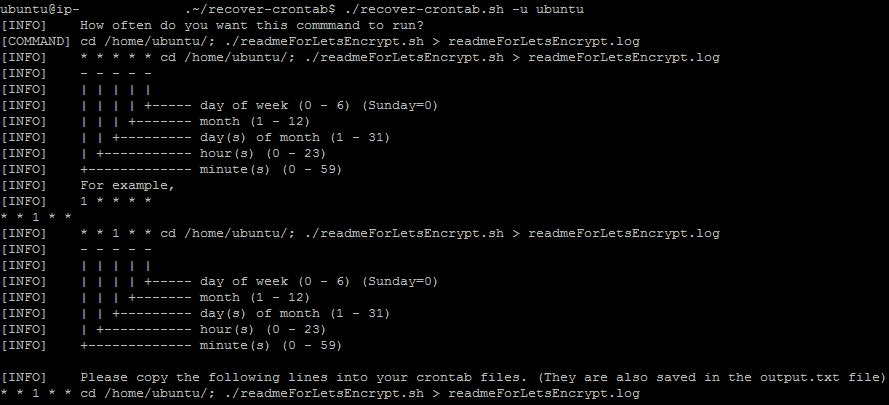

# recover-crontab

A bash script that will help you to recover a destroyed crontab.


Recover-crontab was inspired by [this project](https://github.com/dangreenisrael/recover_crontab). Use it as you like.

## Why is this useful?

Cron jobs can easily be removed when the wrong command is executed. For example, crontab -r. By using this script, it will help the user to recover all their cron commands/jobs.

## Installation

```
git clone https://github.com/poanchen/recover-crontab.git
cd recover-crontab
```

## Environment
Tested on Ubuntu 14.04.5 LTS Server

## Usage

```
Usage: ./recover-crontab.sh [option] ... [arg]
Options:
-u arg : the username whose cron commands you are trying to recover
```

For example,

```
./recover-crontab.sh -u ubuntu
```
Note: For each command that it found, it will promote user input for the cron time. At the end, you can find the ready-to-go command from the stdout or output.txt file.

## Screenshots

